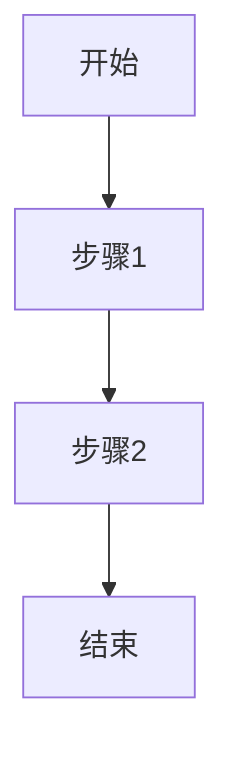

# 单一功能模块 PRD 模板（1500-5000字）

## 1. 需求背景
- 业务背景：
- 当前问题：
- 改版/新增动因：

## 2. 目标与指标
- 业务目标：
- 用户目标：
- 衡量指标（核心/辅助）：

## 3. 角色与权限
- 角色A：
- 角色B：
- 权限边界：

## 4. 功能范围
- 本次范围（In Scope）：
- 非本次范围（Out of Scope）：

## 5. 核心流程

## 6. 详细规则
- 输入规则：
- 校验规则：
- 状态流转规则：
- 展示规则：

## 7. 异常与边界处理
- 异常1：
- 异常2：
- 边界条件：

## 8. 交互与文案要点
- 页面/弹窗说明：
- 关键按钮文案：
- 错误提示文案：

## 9. 数据与埋点
- 关键事件：
- 属性字段：
- 监控看板口径：

## 10. 验收标准
1. 正常路径验收：
2. 异常路径验收：
3. 回归范围：

## 11. 发布计划
- 灰度策略：
- 回滚策略：
- 协作排期：
