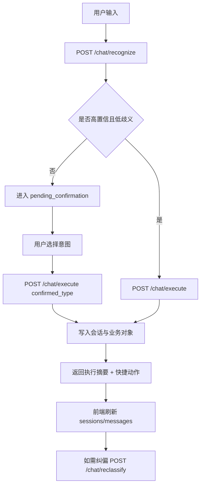

# 事实PRD（单一功能模块）- Chat对话执行与纠偏模块

- 文档类型：单一功能模块（事实版）
- 模块范围：对话识别、执行、确认、纠偏、会话读取
- 快照日期：2026-04-23
- 方向依据：`文档/项目核心总纲.md`、`文档/项目功能文档.md`
- 实现依据：`apps/web/src/pages/ChatPage.tsx`、`apps/web/src/hooks/useChatLogic.ts`、`apps/edge-worker/src/routes/chat.ts`、`apps/edge-worker/src/services/chat/*`

## 1. 需求背景
当前项目把 Chat 定义为“低成本表达入口”，目标不是单纯聊天，而是把一句自然语言尽量转成结构化结果（待办、记录、关注、设置等），并且支持纠偏。历史上该链路存在前端回退导致“看似成功但未入库”的风险，现阶段已经把失败口径改为显式失败，默认不走前端业务假写。

## 2. 目标与指标（事实可验）
- 目标1：用户输入能被识别并进入统一执行链。
- 目标2：对歧义输入触发“待确认”而非误写。
- 目标3：执行结果可回到会话消息流，并附可继续动作。
- 目标4：会话可按用户维度读取，避免跨用户串读。
- 目标5：纠偏动作（reclassify）能在正式链路重写结果。

当前阶段没有在代码中声明独立 KPI 指标值；验收以接口行为正确性与自动化通过为准。

## 3. 角色与权限
- 普通登录用户：可访问 `chat/sessions`、`chat/recognize`、`chat/execute`、`chat/reclassify`。
- 未登录用户：访问上述受保护链路返回 `401`。
- 跨用户访问：读会话消息时返回 `403`（会话存在但不属于当前用户）。

鉴权来源为服务端 session cookie（`jianbao_session`），不再接受旧 `user_id/x-user-id/x-user-email` 透传口径。

## 4. 功能范围
- In Scope
  - 意图识别：`POST /api/v1/chat/recognize`
  - 对话执行：`POST /api/v1/chat/execute`
  - 纠偏执行：`POST /api/v1/chat/reclassify`
  - 会话列表：`GET /api/v1/chat/sessions`
  - 会话消息：`GET /api/v1/chat/sessions/:session_id/messages`
  - 前端会话回填与缓存：`useChatLogic`
- Out of Scope
  - 多轮复杂推理规划代理
  - 自定义意图 DSL
  - 多模型路由策略

## 5. 核心流程

## 6. 详细规则（代码事实）
### 6.1 意图识别
- 识别入口：`parseIntent(text, currentInterests)`。
- 当前主要意图：`create_todo`、`record_thought`、`fragmented_thought`、`add_interest`、`remove_interest`、`set_push_time`、`query_stats`、`chat_only`。
- 识别策略：关键词/模式/模糊 + fallback。
- 候选意图：`buildCandidateIntents` 会追加可替代意图，并默认包含 `chat_only`。

### 6.2 何时触发“待确认”
- 仅对内容写入类意图（待办/记录/碎片）考虑确认。
- 当候选意图不止 1 且置信度 `< 0.9` 时触发 `requiresConfirmation=true`。
- 后端会回写 `pending_confirmation` 类型助手消息，前端展示候选按钮。

### 6.3 执行路径
- `/chat/execute` 会先确保会话存在（`getOrCreateActiveSession`），先写用户消息，再写助手结果消息。
- 确认态执行由 `executeConfirmedChatAction` 分流：
  - `create_todo` -> todo action
  - `record_thought/fragmented_thought` -> note action
  - `add_interest/remove_interest` -> interest action
  - `set_push_time/query_stats` -> settings action
  - `chat_only` -> 仅回复，不写业务对象
- 若执行异常：返回 `500` + “执行失败，未写入数据库”。

### 6.4 纠偏路径
- `/chat/reclassify` 入口参数：`target_intent`、`correction_from`、`original_input`。
- 成功后回写新的助手执行消息，并带 `changeLog/quickActions` 供继续修正。
- 失败返回显式错误，不伪造成功。

### 6.5 前端读取与缓存
- 前端优先读取正式会话（`getChatSessions` + `getChatSessionMessages`）。
- 本地 `localStorage` 仅作聊天缓存兜底（`jianbao_chat_state_v1`），不是业务真源。
- `chatReadMode` 有 `formal/cache/empty` 三态，UI可见当前读取方式。

## 7. 异常与边界处理
- 未登录：`401 Authentication required`。
- 访问他人会话：`403 无权访问该会话`。
- 会话不存在：`404 当前会话不存在`。
- 执行异常：`500` 且返回“未写入数据库”语义。
- 歧义输入：进入待确认，而非直接落库。
- 纠偏失败：保留原结果并提示重试。

## 8. 前端交互要点（事实）
- `ChatPage` 支持输入模式切换：智能判断/待办/记录/碎片/仅聊天。
- 执行后展示“本轮摘要”，并提供 `deepLink` 跳页入口。
- 对待确认消息展示候选意图快捷按钮。
- 对已执行消息可展示 change log 与纠偏动作。

## 9. 验收标准
1. 正常识别执行：输入“明天提醒我投简历”应形成 `create_todo` 执行结果，并在行动页可见。
2. 歧义确认：低置信输入触发待确认卡片，用户选定后再执行。
3. 仅聊天模式：输入在 `chat_only` 下不新增待办/记录对象。
4. 会话持久化：刷新后可读取正式会话历史，不仅是本地临时消息。
5. 资源隔离：用户A不可读取用户B会话，返回 `403`。
6. 纠偏闭环：从“待办”纠偏到“记录”后，消息流出现纠偏结果说明。

## 10. 当前已知限制
- 规则识别仍可能出现“记录语句被待办信号抢占”的风险（文档已标注）。
- 候选意图体系目前是规则型，不是模型驱动的统一排序系统。
- Chat 的 UX 已产品化一轮，但仍有持续收口空间（文案、细节、误判反馈）。

## 11. 证据来源
- `apps/web/src/pages/ChatPage.tsx`
- `apps/web/src/hooks/useChatLogic.ts`
- `apps/edge-worker/src/routes/chat.ts`
- `apps/edge-worker/src/services/chat/intent.ts`
- `apps/edge-worker/src/services/chat/actions.ts`
- `文档/项目功能文档.md`
- `文档/进行中/当前阶段总表.md`
