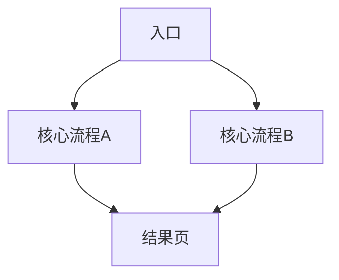

# 完整项目/中型产品 PRD 模板（8000-25000字）

## 1. 项目概述
- 项目名称：
- 项目背景：
- 商业目标：
- 版本范围：

## 2. 业务背景与问题定义
- 行业/市场背景：
- 现状问题：
- 机会点：

## 3. 用户研究与角色画像
- 目标用户群：
- 用户角色（Persona）：
- 核心场景：

## 4. 产品目标与成功指标
- 北极星指标：
- 分阶段目标：
- 指标口径定义：

## 5. 功能架构与全功能列表
- 一级模块：
- 二级功能：
- 版本优先级（P0/P1/P2）：

## 6. 全局业务流程

## 7. 功能详细说明（按模块展开）
### 7.1 模块A
- 功能目标：
- 详细用例：
- 业务规则：
- 异常处理：

### 7.2 模块B
- 功能目标：
- 详细用例：
- 业务规则：
- 异常处理：

## 8. 非功能性需求
- 性能要求：
- 可用性要求：
- 安全与权限：
- 合规要求：

## 9. 数据方案与埋点
- 核心对象与字段：
- 事件埋点清单：
- 报表与监控：

## 10. 接口与系统边界
- 外部系统依赖：
- 接口约定：
- 失败重试与降级：

## 11. 发布与运营计划
- 里程碑：
- 灰度上线：
- 运营配合：

## 12. 验收与测试策略
- 功能验收：
- 回归策略：
- UAT计划：

## 13. 风险与预案
- 关键风险：
- 影响评估：
- 应对预案：

## 14. 附录
- 术语表：
- 参考文档：
- 变更记录：
