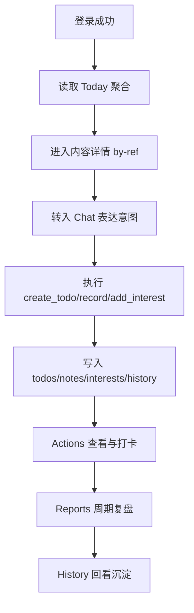

# 事实PRD（完整项目/中型产品）- AI简报助手（时代与我）

- 文档类型：完整项目事实PRD
- 快照日期：2026-04-23
- 文档目标：在“方向以文档为标准、实现以代码为标准”的前提下，沉淀当前可复验的产品与系统事实

## 1. 项目概述
- 项目名称：AI简报助手（时代与我）
- 一句话定义：围绕“今日信息 -> 行动转化 -> 自我记录 -> 周期回顾”运行的个人信息助手系统。
- 当前阶段：Cloudflare Workers 迁移主线已完成；进入产品层尾差清理与人工验收补强阶段。
- 当前正式在线形态：`apps/web`（前端）+ `apps/edge-worker`（Hono API）+ Cloudflare D1（数据）。

## 2. 业务背景与问题定义
### 2.1 背景
用户面对的信息流碎片化、行动断裂、复盘成本高。传统内容应用只解决“看”，待办应用只解决“做”，日志应用只解决“记”，无法自然打通。

### 2.2 问题
- 热点与机会浏览后难落到可执行动作。
- 记录、关注、待办分散在不同工具，难形成连续沉淀。
- 周期复盘缺少统一对象读侧。

### 2.3 现阶段目标
- 保持正式主链稳定（不回退 mock、不回退旧接口拼装）。
- 完成页面级尾差清理与人工验收证据。
- 继续补权限与执行链的稳定性证明。

## 3. 用户角色与场景
### 3.1 目标用户
- 需要持续关注行业动态并希望快速行动的人群。
- 对“轻输入、快执行、可回看”有明显需求的个人用户。

### 3.2 核心使用场景
1. 今日浏览：登录后读取 Today 聚合内容。
2. 内容深化：从热点/推荐进入统一内容详情。
3. 对话转化：把一句话转待办/记录/关注调整。
4. 行动推进：在行动页查看待办、打卡、跟进。
5. 周期复盘：通过历史报告列表按 `report_id` 查看周/月/年报。

## 4. 产品边界与系统边界
### 4.1 正式主线边界
- 正式前端：`apps/web`
- 正式后端：`apps/edge-worker`
- 正式数据库：Cloudflare D1（迁移与 seed 在 `infra/cloudflare/d1`）
- 共享契约：`packages/contracts/src/page-data.ts`

### 4.2 非主线边界
- `app/`：离线/参考/验证链，不承担在线主后端。
- `apps/web/demo/mock-data`：演示数据，不是线上事实源。

## 5. 信息架构与页面地图（事实）
### 5.1 路由层
正式路由由 `apps/web/src/App.tsx` 管理，登录态由 `ProtectedRoute` 统一守卫。

主要路由：
- 非登录：`/welcome`、`/login`、`/interest-config`、`/preview`
- 登录后主链：`/today`、`/chat`、`/actions|/todo`、`/growth`、`/me`
- 内容与沉淀：`/hot-topics`、`/article`、`/collections`、`/history-logs`、`/history-brief`
- 报告：`/weekly-report`、`/monthly-report`、`/annual-report`
- 设置：`/settings`、`/notification-settings`、`/ai-provider-settings`、`/help-feedback`、`/about`
- 调试联调：`/ai-digest-lab`（受保护）

### 5.2 页面与接口映射（核心）
- Today：`GET /api/v1/dashboard/today`
- 文章详情：`GET /api/v1/content/by-ref`
- 热点列表：`GET /api/v1/content/hot-topics`
- 行动概览：`GET /api/v1/actions/overview`
- 打卡：`POST /api/v1/actions/check-in`
- 对话识别/执行/纠偏：`POST /api/v1/chat/recognize|execute|reclassify`
- 会话读侧：`GET /api/v1/chat/sessions`、`GET /api/v1/chat/sessions/:id/messages`
- 兴趣与设置：`GET/PUT /api/v1/preferences/interests|settings|ai-provider`
- 成长页：`GET /api/v1/preferences/growth-overview`
- 报告：`GET /api/v1/reports`、`/weekly`、`/monthly`、`/annual`
- 收藏/记录/待办/历史/反馈：对应 `favorites/notes/todos/history/feedback`
- 系统支撑链：`/api/v1/system/*`

## 6. 功能清单与当前状态
### 6.1 首页与内容链
- Today 聚合读侧已正式化。
- 内容详情按 `content_ref` 统一读取（`hot_topic/article/opportunity`）。
- 相关推荐和加工仍偏规则型实现。

### 6.2 对话执行链
- 识别、执行、确认、纠偏、会话读侧已落地。
- 失败口径已收为显式失败，不再默认前端假写成功。
- 记录类语句存在被待办规则抢占的已知风险。

### 6.3 行动链
- 待办读写、完成、删除已落地。
- 打卡状态走后端真实状态。
- 收藏与跟进行为已并入行动概览。

### 6.4 成长与报告
- Growth 关键词与画像快照已接通正式读侧。
- 报告列表支持历史对象，周/月/年报支持按 `report_id` 读取。

### 6.5 反馈与设置
- 反馈提交、通知设置、AI Provider 设置均有正式接口。

### 6.6 系统支撑链
- `summary_tasks`、`ingestion_runs`、`ai_processing_runs`、`operation_logs`、`replay_tasks` 接口已落地。
- 内部执行器接口要求 `Authorization: Internal <token>`。

## 7. 核心业务流程（主闭环）

## 8. 权限与鉴权
- 用户身份来源：服务端 session cookie。
- 未登录访问受保护路由：返回 `401` 或前端重定向 `/welcome`。
- 资源级越权：关键对象已补第一批+第二批 `403` 回归。
- 内部执行器接口：要求 internal token；未配置时返回 `503`，token 不匹配返回 `401`。

## 9. 数据方案（D1事实层）
### 9.1 核心业务表
- 用户与偏好：`users`、`user_settings`、`user_interests`、`user_profiles`、`user_sessions`
- 内容与机会：`hot_topics`、`opportunities`、`rss_sources`、`rss_articles`
- 行为沉淀：`todos`、`favorites`、`notes`、`history_entries`、`opportunity_follows`
- 报告与简报：`reports`、`briefings`

### 9.2 支撑链与执行链表
- 调度与投递：`briefing_schedules`、`briefing_dispatch_logs`
- 机会执行：`opportunity_execution_results`
- 运行观测：`ingestion_runs`、`ai_processing_runs`、`operation_logs`、`replay_tasks`
- 摘要任务：`summary_generation_tasks`、`summary_generation_results`

## 10. 非功能要求（当前已形成的口径）
- 唯一准入门槛：`npm.cmd run check`
- 当前门槛构成：web build + web lint + Python pytest + workers typecheck/vitest
- 当前测试事实源：`文档/进行中/当前测试与验收总表.md`
- 最近快照（2026-04-22）：`check` 通过；Python `75 passed`；Workers `18 files / 101 tests`。

## 11. 部署与运行
- Workers API（生产）：`https://ai-briefing-assistant.aibriefing2026.workers.dev`
- Pages（生产）：`https://ai-briefing-5d0.pages.dev`
- 本地标准命令：`setup / dev / check`
- 快捷命令命名空间：`task:*`（不替代基础口径）

## 12. 当前风险与未闭合项
1. 页面级人工验收与截图证据仍需补齐。
2. 资源级权限覆盖仍在持续扩面（虽已完成多轮）。
3. 报告可信度口径（`insufficient_data` 与指标定义）仍需进一步收口。
4. Chat 规则识别的边界误判仍有现实风险。
5. `app/` 仍在根目录，处于迁移兼容阶段，需避免误把其当在线主链。

## 13. 当前验收标准（项目级）
1. `npm.cmd run check` 全绿。
2. 受保护页面登录前拦截、登录后可访问、退出后再次拦截。
3. Today -> Content by-ref -> Chat execute -> Actions -> Reports 的主闭环可跑通。
4. 历史报告可按 `report_id` 打开正确对象。
5. 跨用户访问关键对象返回 `403`。

## 14. 证据来源
- 文档：
  - `文档/项目核心总纲.md`
  - `文档/技术现实清单.md`
  - `文档/项目功能文档.md`
  - `文档/进行中/当前阶段总表.md`
  - `文档/进行中/当前测试与验收总表.md`
- 代码：
  - `apps/web/src/App.tsx`
  - `apps/web/src/services/api.ts`
  - `apps/edge-worker/src/index.ts`
  - `apps/edge-worker/src/routes/*.ts`
  - `infra/cloudflare/d1/migrations/*.sql`
  - `packages/contracts/src/page-data.ts`
