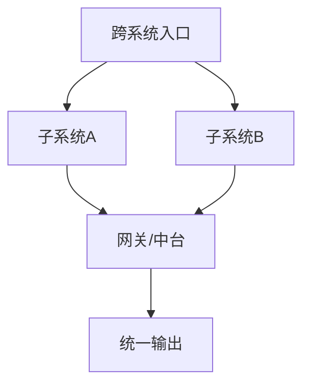

# 大型平台/系统级 PRD 模板（30000字以上）

## 1. 文档体系说明
- 主文档目标：
- 子模块文档列表：
- 与BRD/技术设计文档关系：

## 2. 战略与业务背景
- 战略目标：
- 业务边界：
- 组织协同范围：

## 3. 平台全景与子系统划分
- 子系统清单：
- 子系统职责边界：
- 跨系统协作关系：

## 4. 角色、组织与权限模型
- 组织层级：
- 角色矩阵：
- 权限模型（RBAC/ABAC）：
- 审批链路：

## 5. 全局业务流程与关键链路

## 6. 分模块详细需求（建议每个子系统独立文档）
### 6.1 子系统A
- 目标：
- 功能清单：
- 详细规则：
- 异常处理：

### 6.2 子系统B
- 目标：
- 功能清单：
- 详细规则：
- 异常处理：

## 7. 合规与审计要求
- 法规清单：
- 数据合规：
- 审计日志要求：
- 留痕与追溯：

## 8. 接口协议与集成规范
- API协议规范：
- 消息规范：
- 幂等与重试：
- 超时与熔断：

## 9. 非功能性总要求
- 性能与容量：
- 可用性与容灾：
- 安全基线：
- 可观测性：

## 10. 数据架构与治理
- 主数据定义：
- 数据质量规则：
- 指标口径治理：
- 埋点与数据资产：

## 11. 上线策略与运维协同
- 分阶段上线：
- 灰度与回滚：
- 运行手册：
- 监控告警：

## 12. 风险管理与应急预案
- 风险分级：
- 应急机制：
- 跨团队响应：

## 13. 子文档模板建议
- BRD模板：
- 技术设计模板：
- 接口协议模板：
- 测试验收模板：
