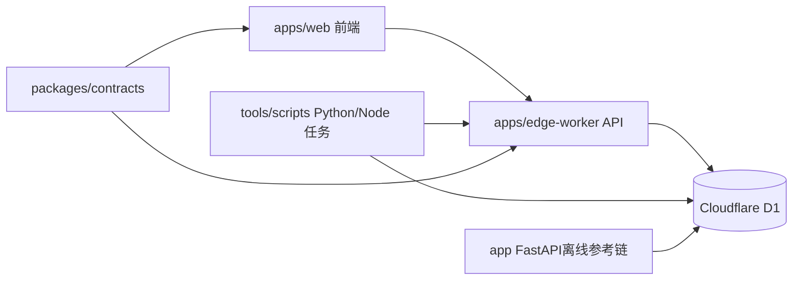

# 事实PRD（大型平台/系统级）- AI简报助手平台架构与治理基线

- 文档类型：系统级事实PRD（主文档）
- 快照日期：2026-04-23
- 文档定位：为后续“主文档 + 子模块文档 + 技术设计文档”拆分提供事实基线

## 1. 文档体系与边界
### 1.1 本文档职责
- 沉淀当前平台级事实：子系统、权限、数据、接口、执行链、运维链。
- 明确“已正式化”与“仍在收口”的边界，避免把规划误写成现状。

### 1.2 本文档不承担
- 单页面 UI 细节说明。
- 未来功能蓝图拍板。
- 具体实施排期管理。

### 1.3 建议后续拆分
- 主文档：本文件（平台事实与治理）
- 子文档A：产品读侧（Today/Content/Actions/Growth/Reports）
- 子文档B：Chat 执行与纠偏链
- 子文档C：System 执行器与观测链
- 子文档D：数据模型与契约治理

## 2. 平台全景
当前平台是“前端产品层 + 边缘API层 + 云数据库层 + 离线执行与验证层 + 契约治理层”的组合架构。

## 3. 子系统划分与职责
### 3.1 子系统一：前端产品系统（apps/web）
- 角色：用户交互入口，承接页面路由、展示、轻状态管理。
- 事实边界：正式页面与 demo 分层；业务真源由后端接口返回。
- 关键约束：不把 demo 路由重新挂入正式 Router。

### 3.2 子系统二：在线API系统（apps/edge-worker）
- 角色：在线正式 API 主后端。
- 技术：TypeScript + Hono + Workers。
- 路由面：`auth/dashboard/actions/content/preferences/chat/reports/favorites/notes/todos/history/feedback/system`。
- 关键约束：受保护路由只认 session 用户上下文。

### 3.3 子系统三：数据系统（Cloudflare D1）
- 角色：正式事实源。
- 架构：迁移脚本 + seed 统一收口在 `infra/cloudflare/d1`。
- 主体对象：用户、内容、行为、报告、执行器任务、系统观测日志。

### 3.4 子系统四：离线执行与验证系统（tools + app）
- `tools/scripts`：预检、迁移、验证、采集、摘要执行。
- `app/`：离线参考实现与验证链，不承接在线主流量。

### 3.5 子系统五：契约系统（packages/contracts）
- `page-data.ts` 作为前后端共享页面契约单一源。
- 目标：避免前后端类型漂移。

## 4. 权限模型与身份链
### 4.1 用户鉴权
- 机制：session cookie（`jianbao_session`）+ `user_sessions` 表。
- 登录流程：`/auth/login` 校验后创建会话并写 cookie。
- 登出流程：删除 session 记录与 cookie。

### 4.2 路由保护
- 前端：`ProtectedRoute` 对未登录用户统一重定向 `/welcome`。
- 后端：`resolveUserId/requireSessionUser` 对未登录请求返回 `401`。

### 4.3 资源级授权
- 对 `todos/notes/favorites/reports/chat sessions/summary tasks/replay tasks` 等对象已落地资源归属检查。
- 归属不匹配场景返回 `403`，对象不存在返回 `404`。

### 4.4 内部执行器鉴权
- `/system/ingestion-runs`、`/system/ai-processing-runs`、`/system/summary-tasks/:id/start|complete|fail` 需要 `Internal <token>`。
- token 未配置：`503`。
- token 不合法：`401`。

## 5. 平台接口协议层
### 5.1 外部用户接口（`/api/v1/*`）
- 统一 JSON 返回。
- 错误语义：按 `401/403/404/409/5xx` 区分认证、授权、存在性、状态冲突、系统失败。
- 部分历史 alias（`/api/v1/hot-topics`、`/api/v1/opportunities`）仍保留兼容。

### 5.2 内部执行接口（`/api/v1/system/*`）
- 面向执行器/管道，要求内部 token。
- 任务流转：`summary_generation_tasks` 支持 `queued -> running -> succeeded/failed`。

### 5.3 契约一致性
- 前端 `apps/web/src/types/page-data.ts` 已通过 `@ai-briefing/contracts/page-data` 消费共享类型。
- 避免跨目录相对路径引用导致的脆弱耦合。

## 6. 数据架构与治理
### 6.1 数据域划分
- 账号与偏好域：`users/user_settings/user_interests/user_profiles/user_sessions`
- 内容域：`hot_topics/opportunities/rss_sources/rss_articles`
- 行为域：`todos/favorites/notes/history_entries/opportunity_follows`
- 结果域：`reports/briefings/article_processing_results/hot_topic_processing_results`
- 执行与观测域：`summary_generation_*`、`ingestion_runs`、`ai_processing_runs`、`operation_logs`、`replay_tasks`

### 6.2 关键治理规则
- D1 作为正式事实源；demo 数据仅供演示或 bootstrap。
- 迁移与 seed 统一从 `infra/cloudflare/d1` 管理。
- 当前仍需持续补数据口径文档化（尤其报告可信度字段解释）。

## 7. 关键业务链与系统链
### 7.1 用户主闭环
- Today 聚合 -> 内容详情 -> Chat 执行 -> Actions 推进 -> Reports 复盘 -> History 回看。

### 7.2 支撑执行链
- 摘要任务创建 -> 执行器启动/完成/失败 -> 摘要结果入库 -> `content/daily-digest` 可读 -> `content/consult` 二次追问。

### 7.3 观测与回放链
- 运行日志写入 `operation_logs` -> 用户发起 `replay_tasks` -> 系统按用户范围返回回放任务。

## 8. 非功能与发布治理
### 8.1 准入门槛
- 唯一准入：`npm.cmd run check`。
- 包含：web build、web lint、Python pytest、workers typecheck+vitest。

### 8.2 测试事实源
- 测试数字只在 `文档/进行中/当前测试与验收总表.md` 维护。
- 2026-04-22 快照：`check` 通过，Python `75 passed`，Workers `18 files / 101 tests`。

### 8.3 运行入口治理
- 基础入口：`setup/dev/check`。
- 高频入口：`task:*` 统一命名空间。

## 9. 风险矩阵（系统级）
1. 权限链：虽然已补多轮 `403`，但全域覆盖与人工验收证据仍在补。
2. 语义链：Chat 规则识别仍有误判边界，需持续优化纠偏体验。
3. 可信度链：报告 `dataQuality/insufficient_data` 口径仍需继续收口。
4. 迁移链：`app/` 仍存在于根目录，需持续防止角色漂移为在线主链。
5. 运营链：internal token 轮换流程需继续制度化和演练化。

## 10. 系统级验收基线（当前可执行）
1. `npm.cmd run check` 全绿。
2. 受保护路由未登录拦截正确。
3. 跨用户访问关键资源返回 `403`。
4. internal 执行接口 token 验证生效。
5. 主闭环与摘要执行链可读取到正式对象，不回退 demo 真源。

## 11. 后续文档协同建议
1. 在本文件基础上，拆分“BRD级业务价值文档”和“技术设计文档（接口/表/状态机）”。
2. 为 `system/*` 执行链补一份时序图与失败恢复策略文档。
3. 把权限回归矩阵（401/403/404）从测试代码抽成可读表，作为发布前人工核验单。

## 12. 证据来源
- 方向层：
  - `文档/项目核心总纲.md`
  - `文档/技术现实清单.md`
  - `文档/进行中/当前阶段总表.md`
  - `文档/进行中/当前测试与验收总表.md`
- 实现层：
  - `apps/web/src/App.tsx`
  - `apps/web/src/pages/*.tsx`
  - `apps/web/src/services/api.ts`
  - `apps/web/src/hooks/useChatLogic.ts`
  - `apps/edge-worker/src/index.ts`
  - `apps/edge-worker/src/routes/*.ts`
  - `apps/edge-worker/src/utils/auth.ts`
  - `apps/edge-worker/src/utils/request-user.ts`
  - `apps/edge-worker/src/utils/internal-auth.ts`
  - `infra/cloudflare/d1/migrations/*.sql`
  - `packages/contracts/src/page-data.ts`
