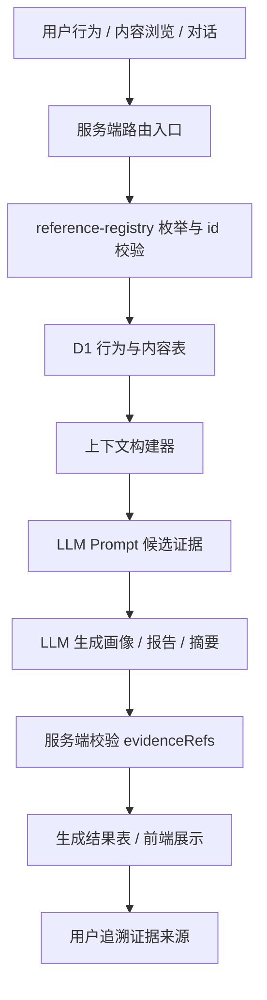

# 多态引用枚举与证据引用规范

日期：2026-04-30

## 目标

项目里已经存在多组多态引用字段，例如 `content_ref`、`source_type/source_id`、`related_type/related_id`、`ref_type/ref_id`。这些字段跨越内容、行为、记录、待办、简报和后续 LLM 生成结果，不能简单用数据库外键覆盖全部关系。

本规范的目标是：

- 把多态引用的允许类型收敛成服务端统一枚举。
- 明确哪些字段可以引用哪些实体。
- 为后续个人画像、报告、摘要等 LLM 生成内容建立可追溯的证据引用结构。
- 避免 LLM 或前端把任意字符串写入 D1，导致后续数据流不可解释。

## 当前实现状态

已新增统一引用注册表：

- `apps/edge-worker/src/services/reference-registry.ts`

当前已接入的入口：

- `favorites.content_ref`：只允许内容实体。
- `history.content_ref` 与 `history_entries.ref_type/ref_id`：先解析 `content_ref`，再按历史引用枚举校验。
- `notes.source_type/source_id`：写入前按来源枚举校验。
- `todos.related_type/related_id`：写入和更新前按关联枚举校验。
- `buildContentRef`：仍只为内容实体生成 `type:id`，不会为 `note`、`todo`、`briefing` 等行为实体生成 `content_ref`。

## 实体引用枚举

| 类型 | 主表/来源 | 本地 id | 可作为 `content_ref` | 可作为 LLM 证据 | 说明 |
|---|---|---:|---:|---:|---|
| `article` | `rss_articles.id` | 是 | 是 | 是 | RSS/文章内容 |
| `hot_topic` | `hot_topics.id` | 是 | 是 | 是 | 热点内容 |
| `opportunity` | `opportunities.id` | 是 | 是 | 是 | 机会内容 |
| `note` | `notes.id` | 是 | 否 | 是 | 用户记录、想法、碎片内容 |
| `todo` | `todos.id` | 是 | 否 | 是 | 行动项 |
| `favorite` | `favorites.id` | 是 | 否 | 是 | 收藏行为记录 |
| `history_entry` | `history_entries.id` | 是 | 否 | 是 | 行为事件记录，当前字段枚举中使用 `history_entries.ref_type/ref_id` 指向别的实体 |
| `briefing` | `briefings.id` | 是 | 否 | 是 | 简报实例 |
| `summary_result` | `summary_generation_results.result_ref` 优先 | 可选 | 否 | 是 | 摘要结果建议优先用稳定 `result_ref`，不要只依赖自增 id |
| `chat_session` | `chat_sessions.id` | 是 | 否 | 是 | 对话会话 |
| `chat_message` | `chat_messages.id` | 是 | 否 | 是 | 对话消息 |
| `opportunity_follow` | `opportunity_follows.id` | 是 | 否 | 是 | 机会跟进状态 |
| `external_item` | 外部 URL / 外部来源 key | 否 | 否 | 是 | 仅用于摘要任务或证据来源，通常搭配 `sourceUrl` |
| `manual` | 用户手动输入 | 否 | 否 | 是 | 手工记录或无法落表的用户输入证据 |
| `chat` | 对话上下文 | 可选 | 否 | 是 | 兼容历史记录，后续建议细分到 `chat_session` / `chat_message` |

## 字段族约束

### `content_ref`

格式：`type:id`

允许类型：

- `article`
- `hot_topic`
- `opportunity`

用途：

- 内容详情跳转。
- 收藏内容。
- 历史事件从内容页写入时的便捷参数。

规则：

- `id` 必须为正整数。
- `note:1`、`todo:1`、`briefing:1` 不是合法 `content_ref`。
- 对非内容实体，需要使用对应字段族或证据引用结构。

### `favorites.item_type/item_id`

允许类型：

- `article`
- `hot_topic`
- `opportunity`

规则：

- 收藏当前只表示“收藏内容”，不表示收藏一条笔记或待办。
- 如果未来要收藏用户资产，应新增资产收藏语义，避免复用当前内容收藏表。

### `history_entries.ref_type/ref_id`

允许类型：

- `article`
- `hot_topic`
- `opportunity`
- `note`
- `todo`
- `briefing`
- `summary_result`
- `favorite`
- `opportunity_follow`
- `chat_session`
- `chat_message`

规则：

- `ref_id` 通常必须是正整数。
- `summary_result` 可没有 `ref_id`，但在 LLM 证据中必须提供 `resultRef`。
- 历史记录可以指向行为或内容，但不承担内容详情跳转职责；详情跳转仍使用 `content_ref`。

### `notes.source_type/source_id`

允许类型：

- `manual`
- `chat`
- `article`
- `hot_topic`
- `opportunity`
- `summary_result`
- `briefing`

规则：

- `manual` 允许 `source_id = null`。
- `chat` 暂时允许 `source_id = null`，用于兼容旧数据；新数据建议指向 `chat_session` 或 `chat_message`。
- 内容类来源必须提供正整数 `source_id`。

### `todos.related_type/related_id`

允许类型：

- `chat`
- `article`
- `hot_topic`
- `opportunity`
- `note`
- `summary_result`
- `briefing`

规则：

- `chat` 暂时允许 `related_id = null`，用于兼容“从对话转为待办”的旧记录。
- 其他类型必须提供正整数 `related_id`。
- `opportunity` 待办完成后仍会触发机会跟进与执行结果写入。

### `summary_generation_tasks/results.content_type/content_id`

允许类型：

- `article`
- `hot_topic`
- `opportunity`
- `external_item`

规则：

- 内容表内实体使用 `content_id`。
- `external_item` 可以没有 `content_id`，但应通过任务参数或结果 `result_ref` 保留外部来源。
- `summary_generation_results.result_ref` 是摘要结果的稳定引用，适合进入 LLM 证据链。

## LLM 证据引用结构

后续个人画像、成长报告、简报摘要等 LLM 生成结果，建议每个关键判断都附带 `evidenceRefs`。

推荐结构：

```json
{
  "claim": "用户最近更关注 AI 工具落地，而不是泛泛阅读资讯。",
  "evidenceRefs": [
    {
      "refType": "note",
      "refId": 31,
      "resultRef": null,
      "sourceUrl": null,
      "title": "补一条记录",
      "snippet": "最近在测试对话助手和简报摘要",
      "reason": "来自用户主动记录，能支撑兴趣变化"
    },
    {
      "refType": "summary_result",
      "refId": null,
      "resultRef": "summary:user:1:2026-04-30",
      "sourceUrl": null,
      "title": "本周摘要",
      "snippet": "AI 接入、对话体验、调用日志",
      "reason": "来自系统摘要结果，能支撑阶段主题"
    }
  ]
}
```

硬性规则：

- LLM 不允许自行编造 `refType/refId/resultRef/sourceUrl`。
- 服务端只把已经查到、可授权、可解释的引用放进 LLM 上下文。
- LLM 输出的证据必须来自上下文中的候选引用。
- 如果 LLM 使用了自然语言证据但没有本地实体，应标记为 `manual` 或 `external_item`，并提供 `sourceUrl` 或由服务端落表后再给出引用。
- 用户可见报告里可以展示摘要化证据，内部存储仍要保留完整 `evidenceRefs`。

## 数据流图



## P5 接入要求

进入个人画像和报告生成阶段时，应按以下顺序接入：

1. 上下文构建器只输出注册表允许的候选证据。
2. Prompt 明确要求模型引用候选 `evidenceRefs`，不允许发明引用。
3. 生成结果落表前，用 `buildEvidenceRef` 或等价校验函数复核证据结构。
4. 前端展示画像/报告时，关键结论旁边保留“来自记录/收藏/摘要/对话”的可追溯来源。
5. 若引用目标已删除或无权限访问，展示层降级为“来源已不可用”，不要暴露越权内容。

## 后续 TODO

- 为个人画像结果表增加 `evidence_refs` JSON 字段。
- 为报告/简报结果增加同样的证据结构。
- 把 `chat` 旧引用逐步迁移或细分为 `chat_session` / `chat_message`。
- 对 `summary_result` 引用优先使用 `result_ref`，减少对自增 id 的依赖。
