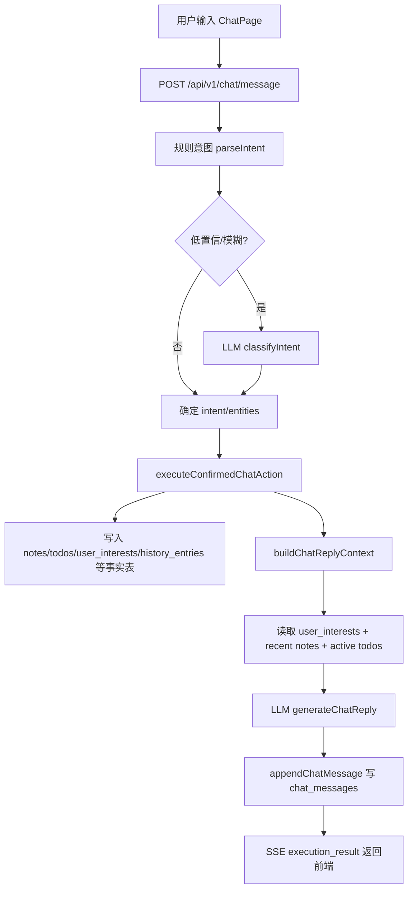
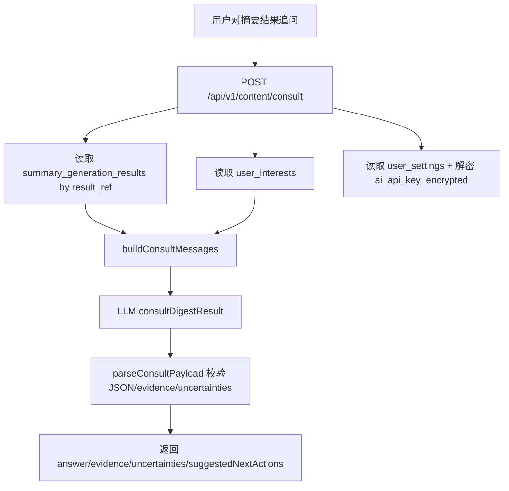
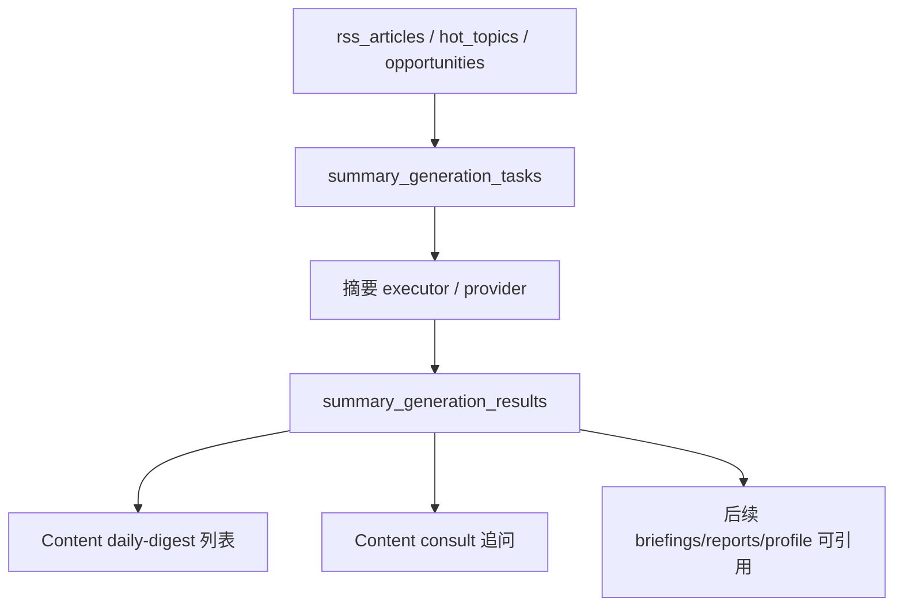
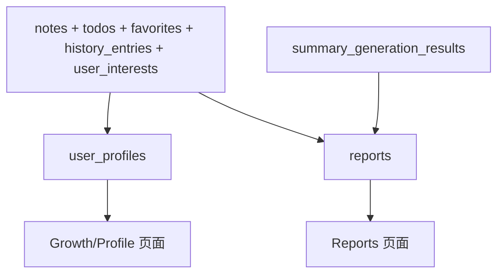

# 数据表说明与 LLM 数据流图

> 日期：2026-04-30  
> 范围：Cloudflare D1 主线数据库，主要对应 `infra/cloudflare/d1/migrations` 与 `apps/edge-worker/src/services`。  
> 定位：给后续 LLM 接入、摘要生成、画像生成、报告生成提供统一数据字典和数据流参照。

---

## 1. 总体分层

当前 D1 表按职责可分为六层：

1. 用户与配置层：用户身份、登录态、推送设置、兴趣、AI Provider 配置。
2. 用户行为沉淀层：记录、待办、收藏、历史行为、机会跟进。
3. 内容源与加工层：RSS、文章、热点、机会，以及内容加工结果。
4. 对话层：会话、消息、意图识别、执行结果沉淀。
5. 摘要/简报/报告层：摘要任务、摘要结果、简报、报告、画像。
6. 运行链路与运维层：采集运行、AI 处理运行、操作日志、重放任务、反馈。

核心原则：

- 事实表和生成结果表分离：原始内容、用户行为是事实；摘要、简报、报告、画像是生成结果。
- LLM 不直接写核心事实表：Chat 里 LLM 只做分类/回复，真实写库仍走规则化 action。
- 用户 API Key 不进入 prompt：用户级 key 已迁移到服务端加密存储字段。
- 多态引用需要代码约束：`ref_type/ref_id`、`source_type/source_id` 灵活但无数据库级 FK。

---

## 2. 表分层说明

### 2.1 用户与配置层

| 表 | 职责 | 主要写入入口 | 主要读取入口 | 生命周期/注意点 |
|---|---|---|---|---|
| `users` | 用户账号基础信息；仍含旧 `interests` 聚合字段 | `auth/register`、`auth/login` demo bootstrap | auth、偏好、各用户数据查询 | `users.interests` 为旧字段，主线应使用 `user_interests` |
| `user_sessions` | 登录 session token hash、过期时间 | `createUserSession()` | `resolveSessionUser()` | 只存 hash，不存明文 token |
| `user_settings` | 推送、提醒、声音震动、AI Provider 配置 | `updateUserSettings()`、`updateUserAiProviderSettings()`、内部迁移接口 | 偏好页、Chat/Consult provider 解析 | `ai_api_key` 为历史明文字段；新保存和迁移走 `ai_api_key_encrypted` |
| `user_interests` | 用户关注领域事实表 | `replaceUserInterests()`、Chat interest action | dashboard、preferences、content consult、chat context | 当前主线关注领域来源 |
| `user_profiles` | 用户画像生成结果缓存 | 画像生成任务，当前未完全 LLM 化 | growth/profile、报告候选 | 后续 P5 需要补 evidence 与版本字段约束 |

`user_settings` AI 字段口径：

- `ai_provider`：用户选择的平台，如 `deepseek`。
- `ai_api_key`：历史兼容明文字段，不应再作为新写目标；0024 已加触发器阻止新增明文。
- `ai_api_key_encrypted`：新保存的密文 key。
- `ai_api_key_encryption_version`：当前为 `aes-gcm-v1`。

---

### 2.2 用户行为沉淀层

| 表 | 职责 | 主要写入入口 | 主要读取入口 | 生命周期/注意点 |
|---|---|---|---|---|
| `notes` | 用户记录、想法、碎片内容 | Notes API、Chat `record_thought` / `fragmented_thought` | Journal、Growth、Reports、Chat context | `source_type/source_id` 是多态来源，无 FK |
| `todos` | 待办、行动项 | Todos API、Chat `create_todo`、reclassify | Actions、Reports、Chat context | `related_type/related_id` 多态关联内容或机会 |
| `favorites` | 用户收藏内容 | Favorites API | Journal、Reports、Growth | `idx_favorites_unique_item` 保证同用户同对象唯一 |
| `history_entries` | 用户行为事件日志 | Chat action、行为接口、系统动作 | History、Growth、Reports、Chat correction | `ref_type/ref_id` 多态引用，需要代码保证有效性 |
| `opportunity_follows` | 用户跟进机会的状态 | Chat/todo opportunity action | Actions、Growth、Journal | 与机会、待办相关，但不是纯内容表 |
| `opportunity_execution_results` | 机会行动执行结果 | 完成相关机会待办时 upsert | Actions、系统链路 | 用于把机会从“看到”推进到“行动结果” |

行为层是后续个人画像、报告、对话上下文的事实来源。LLM 可以读取摘要化上下文，但不应直接写这些表。

---

### 2.3 内容源与加工层

| 表 | 职责 | 主要写入入口 | 主要读取入口 | 生命周期/注意点 |
|---|---|---|---|---|
| `rss_sources` | RSS 源配置、抓取状态 | Python/采集脚本 | 采集链路、运维检查 | 内容源配置表 |
| `rss_articles` | RSS 文章事实表 | 采集脚本 | Content detail、摘要任务、相关内容 | `source_url` 唯一 |
| `hot_topics` | 热点内容事实表 | 采集/同步脚本 | Today、Content detail | 偏展示和推荐 |
| `opportunities` | 机会内容事实表 | 采集/同步脚本 | Today、Actions、Content detail | 可被用户转待办/跟进 |
| `article_processing_results` | 文章加工结果 | Python/AI 加工链 | 内容推荐、摘要候选 | 与 `rss_articles` 分离，便于重跑 |
| `hot_topic_processing_results` | 热点加工结果 | Python/AI 加工链 | 内容推荐、摘要候选 | 与 `hot_topics` 分离，便于重跑 |

内容源层不应混入用户私有生成结果。用户个性化摘要应落在 `summary_generation_*` 或 `briefings/reports` 等结果层。

---

### 2.4 对话层

| 表 | 职责 | 主要写入入口 | 主要读取入口 | 生命周期/注意点 |
|---|---|---|---|---|
| `chat_sessions` | 用户对话会话 | `/api/v1/chat/sessions`、`getOrCreateActiveSession()` | ChatPage 历史会话 | `idx_chat_sessions_single_active` 保证单用户单 active 会话 |
| `chat_messages` | 用户/助手消息、意图、执行摘要 | `/api/v1/chat/message`、confirm、reclassify | ChatPage 消息列表、纠偏 | 存执行结果摘要，不存完整 LLM provider raw response |

当前 Chat LLM 口径：

- `llm-classify`：低置信规则意图时调用；只影响 intent/entities/candidateIntents/replyHint。
- `executeConfirmedChatAction()`：真实写库入口，LLM 不直接写事实表。
- `llm-reply`：执行后生成自然回复和产品内 quick actions。
- `chat/context.ts`：读取轻量个人上下文，最多关注领域 5、记录 3、待办 3。

当前缺口：

- 没有统一的 LLM 调用落表；排查成本、模型、prompt 版本、失败率时只能靠日志和测试。

---

### 2.5 摘要、简报、报告与画像层

| 表 | 职责 | 主要写入入口 | 主要读取入口 | 生命周期/注意点 |
|---|---|---|---|---|
| `summary_generation_tasks` | 摘要生成任务队列/状态 | `/api/v1/system/summary-tasks`、系统 executor | System、任务状态查询 | 任务表，不承载最终正文 |
| `summary_generation_results` | 摘要生成结果 | 系统 executor `completeSummaryTaskAction()` | Content list/detail、Consult | `result_ref` 唯一，是 consult 入口 |
| `briefings` | 用户晨/晚简报结果 | 简报生成链 | Dashboard、Growth、briefing read | 旧 `payload` 与新增 `status/generated_at` 并存 |
| `briefing_schedules` | 用户简报计划 | Preferences、Chat set push time | 调度链路 | 单用户单 `briefing_type` 唯一 |
| `briefing_dispatch_logs` | 简报调度/派发记录 | schedule/executor | 运维与回放 | 记录调度状态，不是简报正文事实源 |
| `reports` | 周/月/年报告结果 | Reports service `upsertReportResult()` | Reports page、Journal | 有唯一 period index，适合缓存生成结果 |
| `user_profiles` | 用户画像结果 | 后续画像生成任务 | Growth/Profile/Reports | 后续应增加 evidence_refs 或 profile_payload 结构版本 |

`summary_generation_tasks` / `summary_generation_results` / `ai_processing_runs` 的边界：

- `summary_generation_tasks`：某个用户、某个内容、某种摘要的业务任务状态。
- `summary_generation_results`：任务完成后的可展示/可咨询摘要结果。
- `ai_processing_runs`：更通用的 AI 运行记录，目前更偏运维统计，不是业务结果读取入口。

---

### 2.6 运行链路与运维层

| 表 | 职责 | 主要写入入口 | 主要读取入口 | 生命周期/注意点 |
|---|---|---|---|---|
| `ingestion_runs` | 采集任务运行记录 | system ingestion endpoints / scripts | chain-health | 面向内容采集运行态 |
| `ai_processing_runs` | AI 加工运行记录 | system ai processing endpoints / scripts | chain-health | 当前还未统一承接 Chat/Consult 调用 |
| `operation_logs` | 操作日志、可重放事件 | system operation endpoints | replay/运维 | 可关联用户，可标记 replayable |
| `replay_tasks` | 重放任务 | system replay endpoints | 运维 | 指向 `operation_logs` |
| `feedback_submissions` | 用户反馈 | Feedback API | 后台/后续分析 | 与 LLM 主链路无直接关系 |

---

## 3. LLM 数据流图

### 3.1 Chat 对话数据流



边界：

- `classifyIntent` 只做识别，不写库。
- `generateChatReply` 只做回复文案和产品内 quick actions。
- 真实写库只发生在 `executeConfirmedChatAction()` 及其子 action。

---

### 3.2 Content Consult 数据流



边界：

- 用户关注领域只用于相关性解释，不作为 evidence。
- `summary_generation_results` 是 consult 的事实锚点。
- 超出材料范围时必须返回“当前材料不足以判断”。
- 当前 Consult 不写结果表；如果后续要保留咨询历史，应新增 `consultation_results` 或统一落 `llm_invocations`。

---

### 3.3 摘要生成数据流



边界：

- `summary_generation_tasks` 管状态。
- `summary_generation_results` 管展示结果和证据上下文。
- `briefings` 和 `reports` 是更高层的用户周期性生成结果，不应直接替代摘要结果表。

---

### 3.4 画像与报告候选数据流



边界：

- `user_profiles` 应是可缓存画像，不是事实源。
- `reports` 应保存周期报告结果，不是临时计算过程。
- 画像/报告后续接 LLM 时应保存 prompt version、model、evidence refs。

---

## 4. 当前不清晰点与治理建议

### 4.1 旧字段与新字段并存

| 问题 | 当前状态 | 建议 |
|---|---|---|
| `users.interests` vs `user_interests` | 主线使用 `user_interests`，旧字段仍存在 | 标注 deprecated；后续迁移清理或只保留只读兼容 |
| `user_settings.ai_api_key` vs `ai_api_key_encrypted` | 新保存写密文；已补内部迁移接口和触发器；本地与远端 D1 当前明文遗留均为 0 | 保留触发器，后续不再写明文 |
| `briefings.payload` | 旧 payload 与后续结构化结果并存 | 后续统一为 `briefing_payload_json` 或明确 payload schema |

### 4.2 LLM 调用统一审计表

已新增 `llm_invocations`，用于统一记录 Chat/Consult 等 LLM 调用的元数据：

```text
llm_invocations
- id
- user_id
- feature: chat.intent_classify | chat.reply | content.consult | summary.generate | profile.generate | report.generate
- request_ref
- provider_name
- provider_source
- model_name
- transport
- status
- duration_ms
- input_chars / output_chars
- prompt_tokens
- completion_tokens
- total_tokens
- error_code
- error_message
- metadata_json
- created_at
```

当前已接入的写入点：

- `chat.intent_classify`
- `chat.reply`
- `content.consult`
- `profile_generation`
- `report_blocks_generation`
- `annual_report_blocks_generation`

注意：该表不存完整 prompt、raw response、API Key。`metadata_json` 会对 prompt/message/input/output/content/answer/token/secret/api_key 等敏感字段做替换。

已新增只读统计接口：

```http
GET /api/v1/system/llm-invocations/stats?days=30&limit=20
```

接口边界：

- 需要登录态。
- 只统计当前用户的调用记录。
- 开发/测试环境允许登录用户访问；生产环境仅 `users.is_superuser=1` 可访问。
- `days` 限制在 1-365 天。
- `limit` 限制在 1-50 条聚合行。
- 返回总量、成功数、失败数、成功率、平均耗时、平均字符量、平均 token、累计 token。
- 返回按 `feature` 聚合、按 `provider/model/transport` 聚合、按 `error_code` 聚合。
- 不返回 `metadata_json`、`error_message`、prompt、raw response 或 API Key。
- 前端入口为开发诊断页 `/system-diagnostics`，只在开发环境从“我的”页显示。

真实本地验收：

```text
GET /api/v1/system/llm-invocations/stats?days=30&limit=10
userId=1
total=10
success=6
error=4
successRate=60
topFeature=annual_report_blocks_generation
topModel=deepseek-v4-flash
topError=invalid_model_output
```

权限与页面验收：

```text
生产环境非 superuser 访问统计接口返回 403。
生产环境 superuser 访问统计接口返回 200。
GET /system-diagnostics 本地开发入口返回 200。
apps/web npm.cmd run build 通过。
```

### 4.3 多态引用需要文档约束

受影响字段：

- `notes.source_type/source_id`
- `todos.related_type/related_id`
- `history_entries.ref_type/ref_id`
- `favorites.item_type/item_id`
- `summary_generation_tasks.content_type/content_id`

建议定义统一枚举：

```text
article -> rss_articles.id
hot_topic -> hot_topics.id
opportunity -> opportunities.id
note -> notes.id
todo -> todos.id
summary_result -> summary_generation_results.id 或 result_ref
```

### 4.4 生成结果应补 evidence_refs

当前 `summary_generation_results` 有 `citations_json`、`source_payload_json`、`consult_context_json`，已经接近可追溯。

后续建议：

- `user_profiles` 增加或规范 `evidence_refs_json`
- `reports.report_payload_json` 内固定 `evidenceRefs`
- `briefings.payload` 内固定 `sourceRefs`

这样 LLM 输出不会成为无来源文本。

---

## 5. 近期建议

按优先级：

1. 写一份多态引用枚举文档，约束 `*_type/*_id`。
2. 在 P5 画像前，先确定 `user_profiles.profile_data` 的 JSON schema 与 evidence refs。
3. 在 P6 报告前，先确定 `reports.report_payload_json` 的 schema 与版本字段。
4. 后续可在诊断页增加时间窗口切换、失败样本跳转和模型成本估算。
