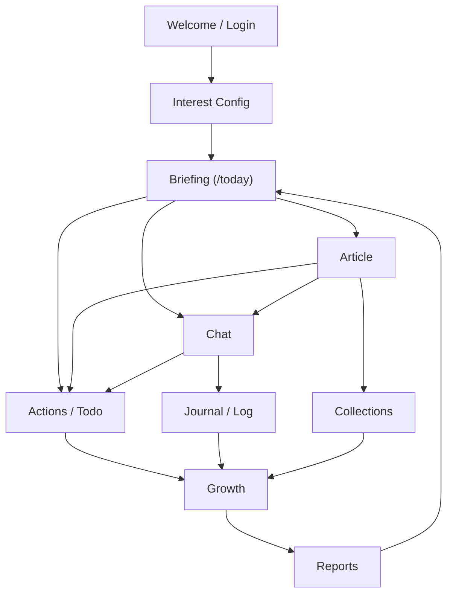

# 2026-05-01 UX 主流程与页面职责规划

## 1. 文档定位

本文件是当前阶段的 UX 逻辑入口，不是视觉稿，也不是代码治理计划。

当前项目已经进入稳定开发期，接下来优先回答这些问题：

- 用户从哪里进入产品；
- 用户每天最需要先看到什么信息；
- 哪些页面负责理解信息，哪些页面负责行动，哪些页面负责沉淀；
- 页面之间的跳转是否形成闭环；
- 按钮和后端能力是否服务于同一个用户目标。

代码治理、组件拆分、样式隔离只作为护栏。除非 UX 决策改变页面职责、信息层级、入口关系或数据契约，否则不启动新的治理主线。

开发期检查入口：

- [2026-05-01-UX收口索引与开发检查清单.md](./2026-05-01-UX收口索引与开发检查清单.md)

## 2. 当前 UX 总判断

当前产品不是一个“信息列表应用”，而是一个“个人简报与行动沉淀助手”。

核心体验不应是让用户自己筛选大量内容，而是：

1. 每天给用户一份像报纸一样的个人简报；
2. 让用户快速看到关注领域的新事件、少量公共热点和原文入口；
3. 允许用户围绕简报追问、速记、收藏或转交待办；
4. 把记录、待办和阅读行为沉淀为后续画像、成长、报告和推荐依据；
5. 第二天继续用沉淀结果改善简报。

因此，主 UX 闭环是：

```text
配置关注
-> 今日简报
-> 阅读/理解
-> 对话追问或速记
-> 记录/收藏/待办
-> 行动管理
-> 成长画像/报告回看
-> 反哺次日简报
```

## 3. 页面分组

### 3.1 进入与配置

页面：

- `/welcome`
- `/login`
- `/interest-config`
- `/settings`
- `/ai-provider-settings`
- `/notification-settings`

职责：

- 建立用户身份；
- 收集初始关注；
- 配置 AI 能力、通知和个人偏好；
- 不承担每日内容消费和行动转化。

UX 风险：

- 如果配置入口太重，用户会在进入主流程前被消耗；
- 如果设置项缺少反馈，用户会误以为保存失败或没有生效；
- 如果 AI Provider 设置和普通设置混在一起，会让非技术用户困惑。

当前判断：

- `/interest-config` 是首次个性化入口；
- `/settings` 应是设置导航和轻量状态页；
- `/ai-provider-settings` 是高级能力配置页，不应成为普通用户主路径。
- `/notification-settings` 是简报通知配置的唯一编辑页；`/settings` 只展示摘要和入口，避免同一配置出现两个编辑器。

单页规格：

- [2026-05-01-Settings配置落点UX规格.md](./2026-05-01-Settings配置落点UX规格.md)
- [2026-05-01-InterestConfig关注配置页UX规格.md](./2026-05-01-InterestConfig关注配置页UX规格.md)

### 3.2 每日主入口

页面：

- `/today`

单页规格：

- [2026-05-01-BriefingPage简报页UX规格.md](./2026-05-01-BriefingPage简报页UX规格.md)

职责：

- 像个人报纸一样呈现当天简报；
- 汇总用户关注领域里今天新发生、被收集到的新事件；
- 提供具体报道、原文链接和继续追问入口；
- 展示少量大家关注的公共热点；
- 提供速记入口，并允许速记保存或转交待办。

UX 风险：

- 如果首屏同时塞太多模块，用户会觉得它是 dashboard 而不是简报；
- 如果行动区和报道区等权，简报页会误变成任务页；
- 如果没有原文或详情入口，简报会失去可追溯性；
- 如果速记只跳 Chat 而没有保存或待办结果，用户会不知道自己是否完成记录。

当前判断：

- `/today` 的代码名可保留，但产品主语应是“简报”；
- 头版摘要是第一权重；
- 关注领域报道是主体；
- 精选热点、速记和对话入口是辅助；
- 做什么、何时做、是否完成，归待办页。

### 3.3 阅读与理解

页面：

- `/article`
- `/hot-topics`
- `/weekly-report`
- `/monthly-report`
- `/annual-report`
- `/history-brief`

职责：

- 承接 Today、Collections、History、Report 等入口；
- 展示详情、摘要、来源、关联内容；
- 支持收藏、分享、打开原文、继续追问；
- 对周期报告提供回看和重新生成入口。

UX 风险：

- Article 如果同时承担阅读、行动、报告、对话、调试，会失去阅读中心；
- Report 如果太像仪表盘，会削弱“回顾和理解”的体验；
- Hot Topics 如果只展示热度，会和 Today 的“值得知道”重复。

当前判断：

- `/article` 是统一详情承接页；
- `/hot-topics` 是热点探索页，不是每日主入口；
- 报告页负责周期性解释，不负责即时行动编排。

单页规格：

- [2026-05-01-ArticlePage阅读详情页UX规格.md](./2026-05-01-ArticlePage阅读详情页UX规格.md)
- [2026-05-01-HotTopics热点探索页UX规格.md](./2026-05-01-HotTopics热点探索页UX规格.md)
- [2026-05-01-Reports周期回看页组UX规格.md](./2026-05-01-Reports周期回看页组UX规格.md)

### 3.4 行动转化

页面：

- `/chat`
- `/todo`
- `/actions`

职责：

- `/chat` 负责追问、确认、执行、记录和上下文延展；
- `/actions`/`/todo` 负责待办、跟进、基础任务和节奏反馈；
- 简报中的速记、报道或对话结果可以被转成可继续推进的行动；
- 今日登录、浏览简报等基础任务也应归待办页，而不是简报页。

UX 风险：

- 如果 Chat 变成万能入口，其他页面会失去职责；
- 如果 Actions 只是待办列表，就不能承接“信息驱动行动”；
- 如果转行动只跳转但没有上下文，用户会忘记为什么要做。

当前判断：

- Chat 是交互层，不是所有功能的页面容器；
- Actions/Todo 是行动工作台，不只是任务列表；
- 简报负责信息输入，Actions/Todo 负责行动生命周期；
- Briefing -> Article/Chat -> Actions/Todo 是核心行动链。

单页规格：

- [2026-05-01-ActionsTodo待办页UX规格.md](./2026-05-01-ActionsTodo待办页UX规格.md)

### 3.5 个人沉淀

页面：

- `/log`
- `/collections`
- `/history-logs`
- `/profile`
- `/growth`
- `/me`

职责：

- 记录用户想法、收藏、行为历史和成长变化；
- 让用户看见自己的长期模式；
- 为推荐、画像、报告提供事实基础。

UX 风险：

- 如果 Journal、History、Collections 都叫“记录”，用户会不知道去哪里找东西；
- 如果 Profile 只有画像，没有证据来源，可信度不足；
- 如果 Growth 同时做画像、报告、历史、设置，会重新混乱。

当前判断：

- `/log` 是主动记录和近期沉淀；
- `/collections` 是用户主动保存的内容；
- `/history-logs` 是系统行为轨迹；
- `/profile` 是用户画像详情；
- `/growth` 是成长概览和导航；
- `/me` 是个人中心，不扩展成第二个首页。

单页规格：

- [2026-05-01-Profile我的画像页UX规格.md](./2026-05-01-Profile我的画像页UX规格.md)
- [2026-05-01-PersonalArchive个人沉淀页组UX规格.md](./2026-05-01-PersonalArchive个人沉淀页组UX规格.md)

### 3.6 系统辅助与内部页

页面：

- `/help-feedback`
- `/about`
- `/ai-digest-lab`
- `/system-diagnostics`
- `/decor-preview`

职责：

- 提供帮助、反馈、说明、内部联调和预览；
- 不进入普通用户每日主路径；
- 不影响正式页面的信息架构。

UX 风险：

- 内部页如果在正式导航中过重，会污染用户主流程；
- preview/lab 页面如果复用正式样式但没有隔离，会再次造成 UI 混乱；
- diagnostics 不应暴露给普通用户的心智主线。

当前判断：

- 这些页面是辅助面，不是主体验；
- 可保留，但需要在导航、入口和样式上持续低权重。

## 4. 主流程图



解释：

- `Briefing` 是每日信息入口，当前技术路由仍为 `/today`；
- `Article` 是理解详情；
- `Chat` 是追问、确认和记录；
- `Actions` 是转化和推进；
- `Journal / Collections / History` 是沉淀；
- `Growth / Reports` 是回看和反哺。

## 5. 关键任务流

### 5.1 新用户首次使用

```text
Welcome
-> Login
-> Interest Config
-> Briefing
```

UX 要求：

- Welcome 只解释价值，不讲复杂功能；
- Login 只完成身份，不做配置；
- Interest Config 只收集最小关注；
- Briefing 必须立即给出可理解的简报。

### 5.2 每日阅读到沉淀

```text
Briefing headline / report
-> Article / original source / Chat
-> 收藏 / 追问 / 速记
-> Journal / Collections
```

UX 要求：

- 简报告诉用户今天关心领域发生了什么；
- Article 给出足够上下文和原文入口；
- Chat 保留来源上下文；
- 速记保存后要进入沉淀体系。

### 5.3 简报到待办

```text
Briefing note / report insight / Chat result
-> Add to Todo
-> Actions / Todo
```

UX 要求：

- 简报页只产生待办候选，不管理待办生命周期；
- 加入待办后，用户应能在待办页看到来源和上下文；
- 今日登录、浏览简报等基础任务也在待办页管理。

### 5.4 信息沉淀到成长

```text
Article / Chat / Actions
-> Journal / Collections / History
-> Profile / Growth
-> Weekly / Monthly / Annual Report
```

UX 要求：

- 沉淀不是孤立仓库，而是后续推荐和画像的依据；
- Profile 必须能看到证据来源；
- Growth 负责概览，不承接所有明细。

### 5.5 用户调整系统

```text
My / Settings
-> Notification Settings / AI Provider Settings / Interest Config
-> Briefing
```

对话配置链路也属于正式系统调整入口：

```text
Chat
-> 识别配置意图
-> 用户确认
-> 写入系统配置
-> 配置成功
-> Settings / Notification Settings / Briefing 验证
```

UX 要求：

- 设置页是导航和状态中心；
- 高级 AI 配置要低干扰；
- 修改关注后应回到简报页验证结果变化。

单链路规格：

- [2026-05-01-Chat配置系统信息链路UX规格.md](./2026-05-01-Chat配置系统信息链路UX规格.md)

## 6. 页面按钮行为原则

按钮不按“页面里能放什么”设计，而按用户意图设计。

### 6.1 主动作

一个页面最多有一个当前最重要主动作。

示例：

- Briefing：查看头版摘要、打开报道或围绕简报追问；
- Article：继续阅读/收藏/追问；
- Actions：推进当前最优先事项；
- Profile：生成或刷新画像；
- Interest Config：完成关注配置。

### 6.2 次动作

次动作应该服务于主动作，而不是制造并列选择。

示例：

- Article 的分享、原文、相关推荐是次动作；
- 简报页的章节导航是辅助浏览，不是主目标；
- Settings 的高级设置入口是次动作。

### 6.3 反馈

任何会影响后端状态的按钮都必须有明确反馈。

最低要求：

- loading 或 disabled；
- 成功提示；
- 失败提示或回滚；
- 保留用户上下文。

当前已有按钮契约检查覆盖部分关键链路，后续新增关键按钮应补入 `tools/scripts/check-ui-action-contracts.mjs`。

## 7. 开发期使用方式

主动 UX 治理到这里收口。后续不把“继续治理”作为默认任务，而是在开发改动触发风险时再回到 UX 判断。

开发时按这个顺序使用现有材料：

1. 先看 [UX 收口索引与开发检查清单](./2026-05-01-UX收口索引与开发检查清单.md)，确认是否需要 UX 复核；
2. 如果需要，查对应单页规格，确认页面职责、主动作和非目标；
3. 如果页面职责变化，再更新 `apps/web/src/pages/README.md`；
4. 如果后端数据或写入能力变化，再更新数据契约、API 和按钮反馈；
5. 如果只是样式、文案或低风险字段修复，不启动新的治理链路。

这意味着：当前不是继续拆页面、继续补长文档、继续重构视觉，而是把已经形成的页面职责用于约束后续开发。

## 8. 当前禁止事项

- 不因为某页看起来拥挤就立即重构视觉；
- 不新增页面来解决页面职责不清；
- 不把 Chat 当成所有功能的入口；
- 不把 Settings 扩展成第二个 MyPage；
- 不把 Growth 扩展成所有沉淀信息的大杂烩；
- 不让 lab、preview、diagnostics 进入普通用户主流程。

## 9. 当前结论

当前 UX 主线应收束为：

```text
Briefing 是每日信息入口，Article 负责理解与原文追溯，Chat 负责围绕内容交互，Actions/Todo 负责行动生命周期，Journal/Collections/History 负责沉淀，Growth/Profile/Reports 负责回看和反哺。
```

后续开发如果不能说明自己服务于这条链路，就应先做 UX 复核；如果只是沿既有页面职责做低风险实现，不需要重新启动治理。
